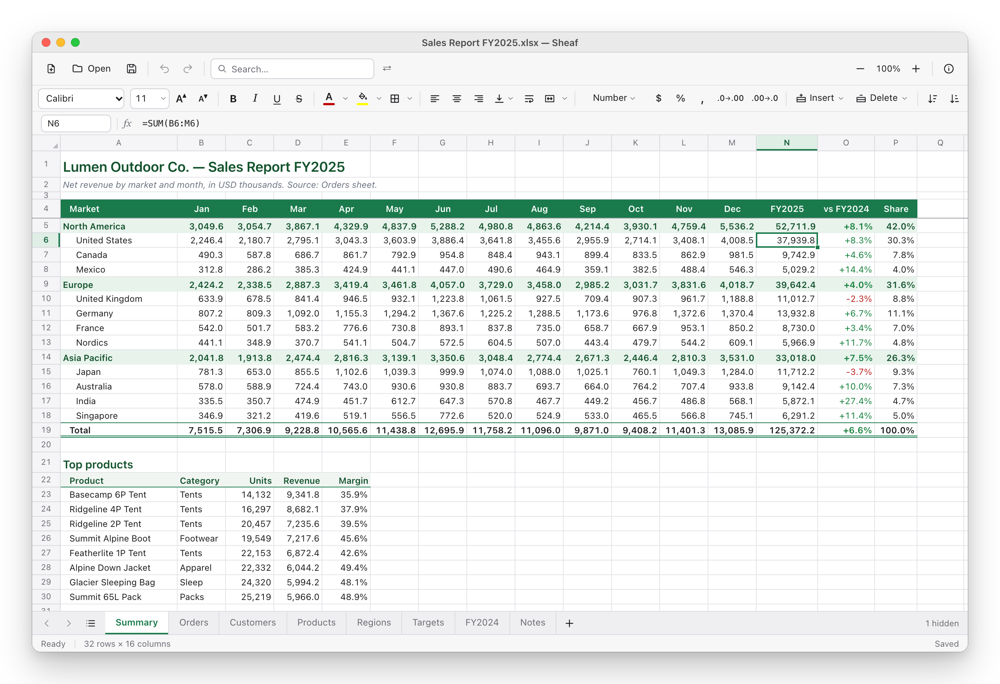
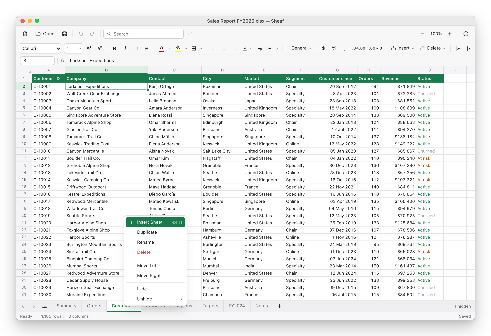
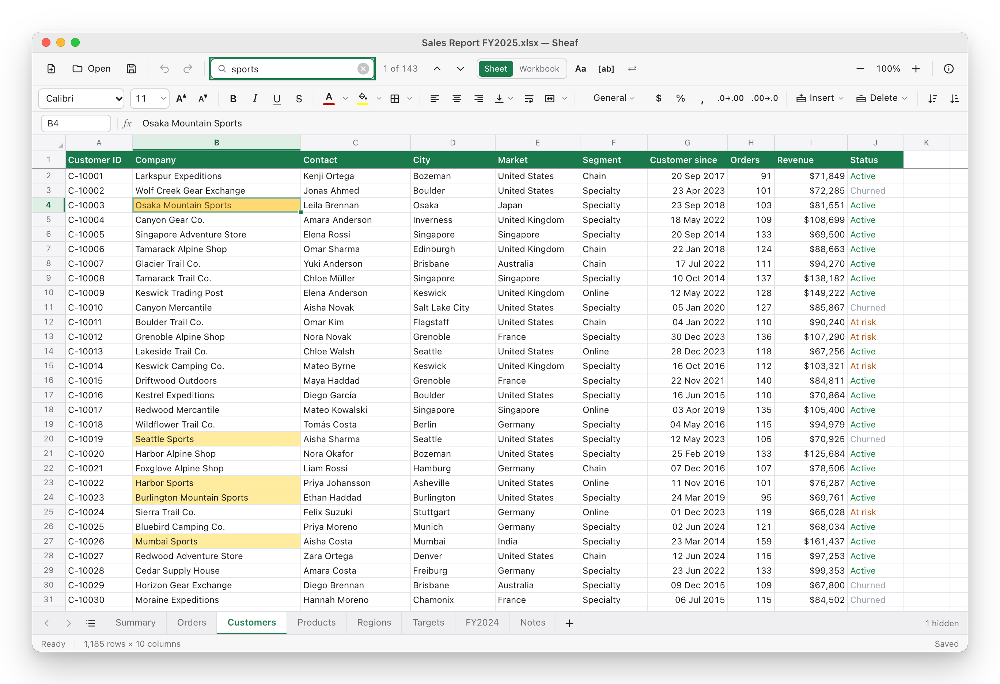
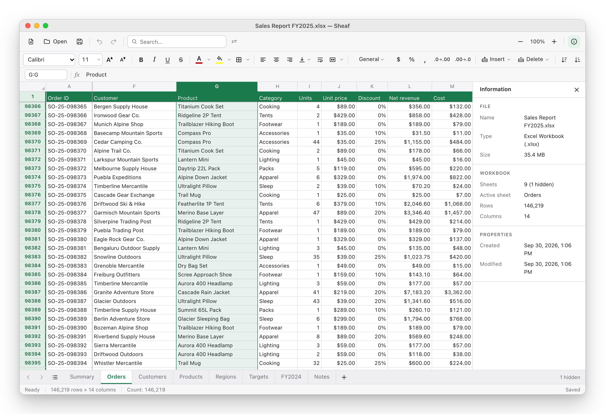
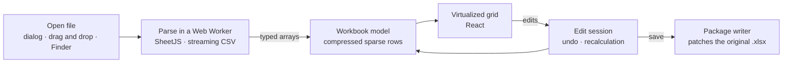

<div align="center">
  
  <h1>Sheaf</h1>
  <p>
    <strong>A fast, lightweight spreadsheet app for the Mac.</strong><br>
    Open, edit and save Excel workbooks and CSV files — no office suite required.
  </p>
  <p>
    <a href="#getting-started"></a>
    <a href="https://v2.tauri.app"></a>
    <a href="https://react.dev"></a>
    <a href="https://www.typescriptlang.org"></a>
    <a href="LICENSE"></a>
    <a href="https://buymeacoffee.com/premvarma"></a>
  </p>
</div>

<picture>
  <source media="(prefers-color-scheme: dark)" srcset="docs/screenshots/main-window-dark.png">
  
</picture>

Sheaf opens `.xlsx`, `.xlsm`, `.xls`, `.csv` and `.tsv` files in a small (~4 MB) desktop app. It shows
workbooks with their formatting, recalculates formulas as you edit, and saves back into the original
file, so charts, images and everything else it doesn't touch stay intact.

## Features

**Viewing**

- Number and date formats, fonts, colors, fills, borders, alignment, wrapped text, merged cells, column
  widths and row heights, as they appear in Excel
- Frozen panes, hidden rows, columns and sheets, and a list of every sheet in the workbook
- A virtualized grid that renders only the cells in view, so sheets with 100,000+ rows scroll smoothly
- Name Box navigation (`B2:D10`, `C:C`, `Sheet2!A1`), zoom from 50% to 200%, and the count, sum and
  average of the selection in the status bar
- Light and dark mode, recent files, and a workbook information panel

**Editing**

- Type values or formulas in a cell or the formula bar; numbers, currency, percentages, dates and times
  are recognized as you type
- 350+ functions (SUM, SUMIFS, COUNTIFS, VLOOKUP, INDEX/MATCH, IF, IFERROR, TEXT, DATE, EOMONTH, …) that
  recalculate across sheets
- A formatting toolbar: font, size, bold, italic, underline, strikethrough, text and fill colors, borders,
  alignment, wrapping, indent, merge & center and number formats
- Insert, delete, hide and unhide rows and columns; formulas, merged cells and tables follow, the way
  they do in Excel
- Add, rename, duplicate, reorder, hide and delete sheets
- Copy and paste with formulas and formatting, Paste Values, Fill Down/Right, a fill handle that
  continues series, sorting, find & replace, and undo/redo

**Saving**

- Save as `.xlsx`, `.xlsm`, `.csv` or `.tsv`
- Only what changed is rewritten inside the original `.xlsx`: charts, images, comments, tables, named
  ranges and themes are kept, and move with the rows and columns you insert or delete
- Files are written atomically, and Sheaf asks before closing a workbook with unsaved changes

## Screenshots

**Sheets** — add, rename, duplicate, reorder, hide and unhide sheets from the tab bar. Formulas follow
renamed sheets.



**Search** — search the sheet or the whole workbook, step through matches, or replace them (⇧⌘H).



**Large workbooks** — this workbook has 146,219 rows of orders across nine sheets. The information
panel (⌥⌘I) shows the file's details.



<sub>The screenshots use a sample workbook with fictional data.</sub>

## Supported files

| Format | Open | Save | Notes |
| --- | :---: | :---: | --- |
| Excel Workbook (`.xlsx`) | ✓ | ✓ | |
| Excel Macro-Enabled Workbook (`.xlsm`) | ✓ | ✓ | Macros are not run |
| Excel 97–2003 Workbook (`.xls`) | ✓ | | Saved as `.xlsx` |
| CSV and TSV (`.csv`, `.tsv`) | ✓ | ✓ | Up to 1,048,576 rows, like Excel |

Workbooks can be up to 200 MB and text files up to 500 MB. Password-protected, corrupted and
unsupported files are reported with a clear message.

**Platforms:** macOS 12 Monterey or later (Apple silicon and Intel), and Windows 10 and 11 (x64).
Windows builds are newer and have had less hands-on testing than the Mac app.

## Getting started

Requirements: [Node.js](https://nodejs.org) 20.19 or later, [Rust](https://rustup.rs) 1.79 or later,
and the Xcode Command Line Tools (`xcode-select --install`).

```bash
git clone https://github.com/PremVarma/sheaf.git
cd sheaf
npm install
npm run app:dev       # start the app with hot reload
```

`npm run dev` serves the same interface in a browser at http://localhost:1420, and `npm run samples`
writes sample files to `samples/` (add `-- --large` for 100,000- and 500,000-row files).

### Building

```bash
npm run app:build
```

This creates `Sheaf.app` and a `.dmg` in `src-tauri/target/release/bundle/`. For a universal binary
(Apple silicon and Intel):

```bash
rustup target add x86_64-apple-darwin aarch64-apple-darwin
npm run app:build -- --target universal-apple-darwin
```

Unsigned builds run on the Mac that built them; other Macs show a Gatekeeper warning. To distribute
the app, [sign and notarize it](https://v2.tauri.app/distribute/sign/macos/).

To open files from the terminal:

```bash
open -a Sheaf report.xlsx
```

### Windows

The [Release workflow](.github/workflows/release.yml) builds the Windows installers (`.msi` and
`-setup.exe`) and a universal macOS `.dmg` on GitHub Actions, and attaches them to a draft release.
Run it from the **Actions** tab, or push a `v*` tag.

To build on a Windows PC instead, install the [Tauri prerequisites](https://v2.tauri.app/start/prerequisites/)
(Microsoft C++ Build Tools and WebView2) and run `npm install` and `npm run app:build`.

## Keyboard shortcuts

| Action | Shortcut |
| --- | --- |
| Open, save, save as | ⌘O, ⌘S, ⇧⌘S |
| Search, find and replace | ⌘F, ⇧⌘H |
| Go to a cell | ⌘G |
| Undo, redo | ⌘Z, ⇧⌘Z |
| Bold, italic, underline | ⌘B, ⌘I, ⌘U |
| Fill down, fill right | ⌘D, ⌘R |
| Paste values | ⇧⌘V |
| Insert rows, delete rows | ⌥⌘=, ⌥⌘− |
| New sheet, next sheet, previous sheet | ⇧F11, Ctrl+Page Down, Ctrl+Page Up |
| Workbook information | ⌥⌘I |

<details>
<summary>All shortcuts</summary>

| Shortcut (macOS / Windows) | Action |
| --- | --- |
| ⌘N / Ctrl+N | New workbook |
| ⌘O / Ctrl+O | Open file |
| ⌘S / Ctrl+S, ⇧⌘S / Ctrl+Shift+S | Save / Save As |
| Typing, F2, double-click | Edit the active cell (Enter / Tab confirm, Esc cancels) |
| ⌥↩ / Alt+Enter while editing | Line break inside the cell |
| Delete | Clear the selected cells |
| ⌘Z / Ctrl+Z, ⇧⌘Z / Ctrl+Y | Undo / redo |
| ⌘X / ⌘V (Ctrl on Windows) | Cut / paste |
| ⇧⌘V / Ctrl+Shift+V | Paste values |
| ⌘D / ⌘R (Ctrl on Windows) | Fill down / fill right |
| ⌘B / ⌘I / ⌘U (Ctrl on Windows) | Bold / italic / underline |
| ⇧⌘X / Ctrl+5 | Strikethrough |
| ⇧⌘L / ⇧⌘E / ⇧⌘R (Ctrl+Shift on Windows) | Align left / center / right |
| ⇧⌘. / ⇧⌘, | Bigger / smaller font |
| ⇧⌘1 / ⇧⌘4 / ⇧⌘5 / ⇧⌘3 / ⇧⌘\` | Number / currency / percentage / date / General format |
| ⌘\\ / Ctrl+\\ | Clear formatting |
| ⌥⌘= / Ctrl+Alt+= | Insert rows (or columns, when whole columns are selected) |
| ⌥⌘− / Ctrl+Alt+− | Delete rows (or columns) |
| ⇧F11 | New sheet |
| ⌘; / Ctrl+; | Type today's date |
| Shift+Space / Ctrl+Space | Select rows / columns |
| ⌘F / Ctrl+F | Search |
| ⇧⌘H / Ctrl+H | Find and replace |
| ↩ / ⇧↩ in search, F3 / ⇧F3 | Next / previous match |
| Esc | Close search |
| ⌘G / Ctrl+G, F5 | Go to cell (Name Box) |
| ⌘C / Ctrl+C | Copy selection |
| ⌘A / Ctrl+A | Select all |
| ⌘+ / ⌘− / ⌘0 (Ctrl on Windows) | Zoom in / out / reset |
| Arrows, Tab, Enter, Page Up/Down, Home | Move the active cell |
| Shift + movement | Extend the selection |
| ⌘/Ctrl + arrows, ⌘/Ctrl+Home/End | Jump to data edges / first / last cell |
| Ctrl+Page Down / Ctrl+Page Up | Next / previous sheet |
| ⌥⌘I / Ctrl+Alt+I | Workbook information |
| ⌘W / Ctrl+W | Close workbook |

</details>

## Architecture

Sheaf is a [Tauri](https://tauri.app) app: a small Rust shell handles files, menus and OS integration,
and the interface is React and TypeScript running in the system WebView.



- **Compact model.** Each sheet's cells are stored in compressed-sparse-row typed arrays with a shared
  string pool, so large sheets use little memory and move from the worker without copying.
- **Parsing off the main thread.** SheetJS runs in a Web Worker that is discarded afterwards; CSV and
  TSV use a streaming parser that writes straight into the model.
- **Rendering.** One native scroll container; headers and frozen panes are sticky bands, and only the
  cells in view are rendered.
- **Recalculation.** A dependency index finds the formulas an edit affects; they are evaluated on
  demand in the right order, and circular references are detected.
- **Saving.** The writer starts from the original package and rewrites only the rows, styles and
  parts that changed or depend on a change (merges, tables, charts, comments, defined names, …).
  Everything else is copied as it is.

```
src/
├── components/     toolbar, grid, sheet tabs, search, status bar, dialogs
├── services/
│   ├── workbook/   parsing (SheetJS worker, CSV), styles, error handling
│   ├── editing/    edit session, undo, recalculation, .xlsx writer
│   ├── formula/    formula parser, evaluator, reference rewriting
│   └── platform/   Tauri and browser integrations
├── models/         workbook model and string pool
└── state/          store, commands and controller
src-tauri/          Rust shell: file access, menus, file associations
```

## Development

```bash
npm test                       # unit and component tests (Vitest, Testing Library)
npm run typecheck
cd src-tauri && cargo test     # Rust tests
```

The tests cover parsing, rendering, search, editing, formulas and reference rewriting. Saving tests
reopen every file they write, require each rewritten XML part to be well-formed, and check that
untouched parts are identical to the original.

## Limitations

- Charts, images and pivot tables aren't displayed; they're kept when you save.
- Conditional formatting, rich text within a cell, rotated text and comments aren't displayed.
- Conditional formats, filters, comments, hyperlinks and data validation can't be edited yet, and
  there's no format painter.
- Formulas that use unsupported functions or syntax (INDIRECT, OFFSET, structured table references,
  array formulas, …) keep their saved value; Excel recalculates them when the file is opened.
- `.xls` files are saved as `.xlsx`, and duplicated sheets don't copy charts, images, comments or tables.

## Contributing

Bug reports and pull requests are welcome. For larger changes, please open an issue first to discuss
the approach. Before sending a pull request, run `npm test` and `npm run typecheck`.

## Support

Sheaf is free and open source. If it saves you time, you can support its development:

<a href="https://buymeacoffee.com/premvarma"></a>

## License

[MIT](LICENSE) © 2026 Prem Varma

Built with [Tauri](https://tauri.app), [React](https://react.dev),
[SheetJS Community Edition](https://sheetjs.com) and [formula.js](https://formulajs.info).
Microsoft Excel is a trademark of Microsoft Corporation; Sheaf is an independent project and is not
affiliated with Microsoft.
